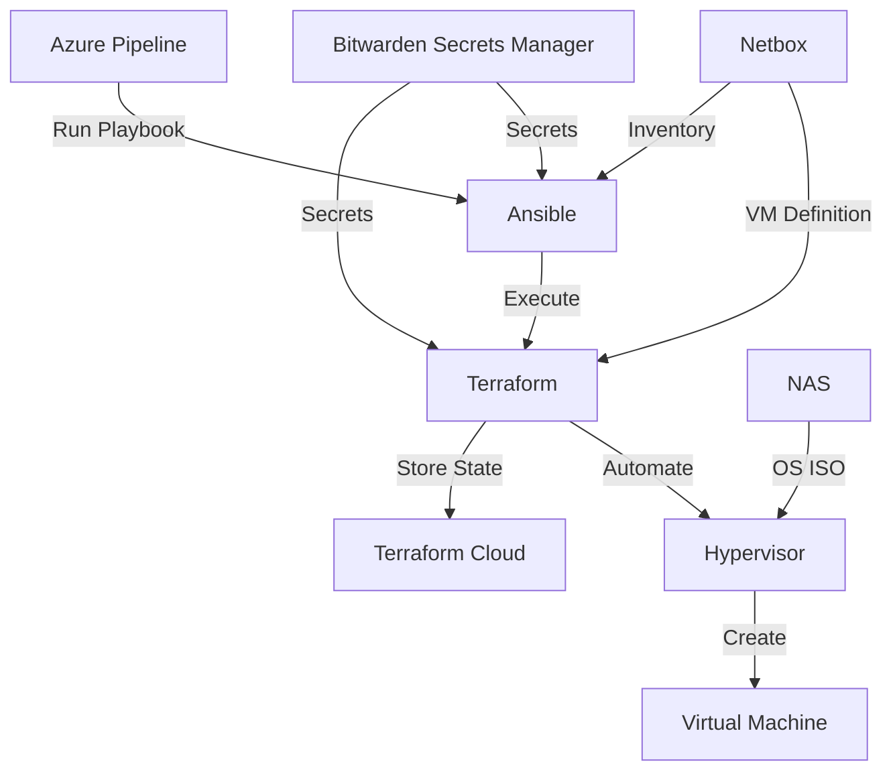

# Virtual Machines

Terraform definitions for deploying virtual machines on multiple hypervisors, using Netbox as a source of truth for configuration and Bitwarden Secrets Manager. State is stored in Terraform Cloud.

## Pre-requisites

- Terraform
- Netbox instance
- Bitwarden Secrets Manager organisation
- Terraform Cloud account

### Environment variables

- `BW_ACCESS_TOKEN`
- `BW_ORGANIZATION_ID`
- `TF_TOKEN_app_terraform_io`
- `TF_WORKSPACE` - format `VMxx`
  
## Usage

- Define the virtual machine on Netbox
- Open the required `cluster` subfolder - the name must match the VM's cluster on Netbox
- Run `terraform init`
- Run `terraform plan -out tfplan`
- Run `terraform apply tfplan`
- To remove a virtual machine, run `terraform destroy`

## Automation

Ansible Playbook (with Azure Pipeline wrapper) in my ansible repository

- Get Terraform Cloud token from Bitwarden Secrets Manager
- Set Environment variables
- Create Terraform workspace if it doesn't exist
- Get Cluster name from Netbox for virtual machine
- Check existing cluster name in Terraform state
- Destroy existing deployment if the cluster is different
- Deploy to the required cluster using Terraform
- Update the VM status to `Staged` in Netbox
- If required, 
  - Wait for the machine to come online
  - Run the `deploy` role to perform machine configuration
  - Update the VM status to `Active` in Netbox
  
And for destroy:

- Get Terraform Cloud token from Bitwarden Secrets Manager
- Set Environment variables
- Check existing cluster name in Terraform state
- Destroy existing deployment
- Update the VM status to `Planned` in Netbox

## Hypervisors

### Supported

- Proxmox (QEMU)

### Planned

- Proxmox (LXC)
- Hyper-V
- XCP-ng
- Apache Cloudstack?